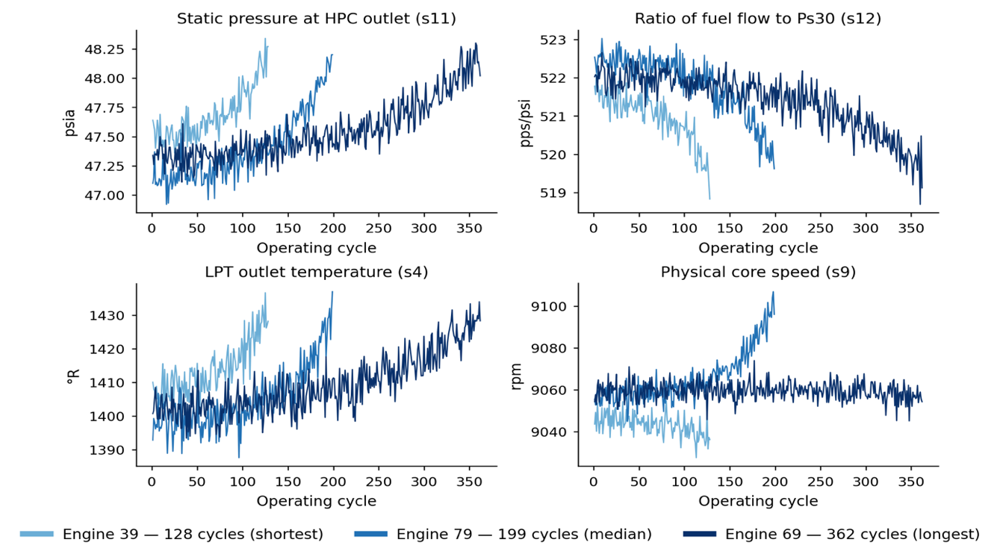
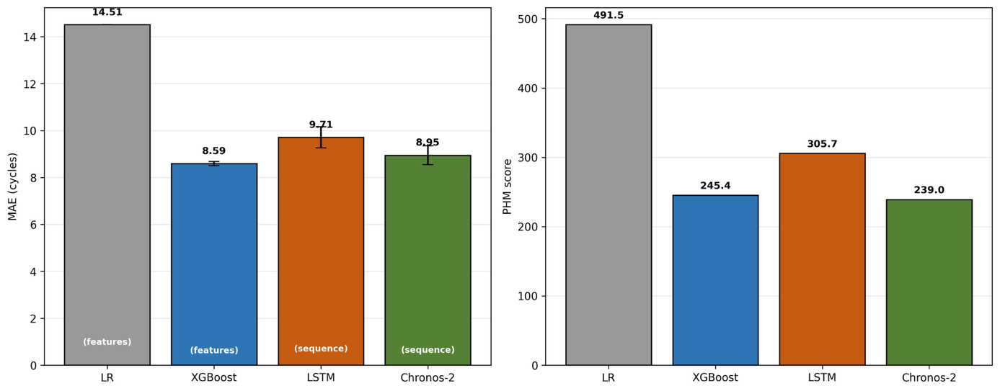
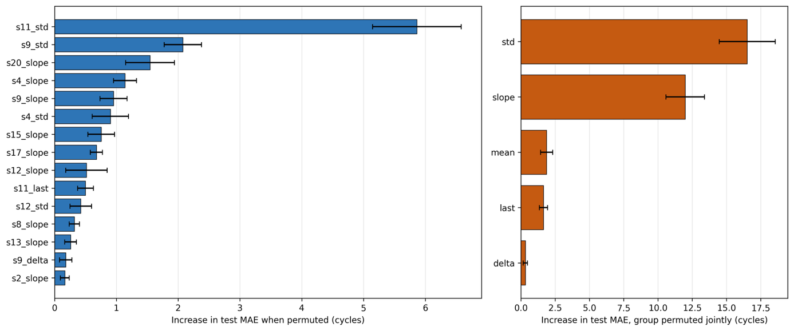
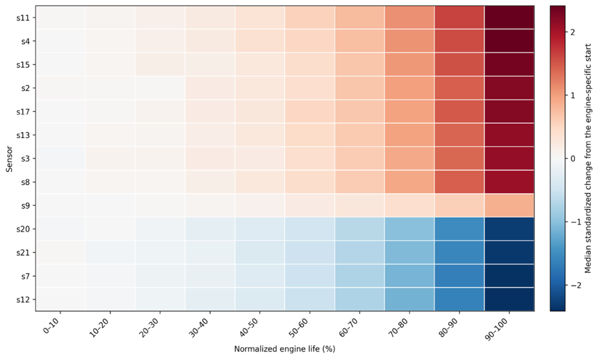
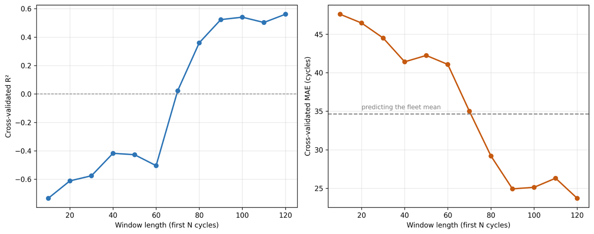

# Remaining Useful Life Prediction on NASA C-MAPSS FD001

A controlled comparison of four modelling pipelines — linear regression, XGBoost, an LSTM, and a frozen
Chronos-2 foundation model — for predicting the Remaining Useful Life (RUL) of turbofan engines.

The point of the study is not to beat a leaderboard. It is to ask whether added model complexity pays off
**once every pipeline is given the same observed history**, and to separate design choices that are usually
changed together.

**Headline result:** under a matched observation horizon, the gap between a gradient-boosted tree ensemble and
two sequence models is not statistically detectable (paired Wilcoxon, Holm-corrected, n = 100 engines), while
their computational cost differs substantially.

---

## Contents

- [Problem](#problem)
- [Dataset](#dataset)
- [Method](#method)
- [Results](#results)
- [What this study does and does not establish](#what-this-study-does-and-does-not-establish)
- [Limitations](#limitations)
- [Repository structure](#repository-structure)
- [Setup](#setup)
- [Reproducing the results](#reproducing-the-results)
- [Thesis](#thesis)
- [License](#license)

---

## Problem

Remaining Useful Life is the number of operating cycles a component can still be expected to run before it
fails. For a turbofan engine one cycle is roughly one flight.

Three things make the task harder than a standard regression problem:

1. **The target is never observed in service.** True remaining life is known only after failure.
2. **The target is constructed, not given.** A linear target assumes a healthy engine already reveals how long
   it will live. A piecewise target holds the label constant while the engine is healthy and lets it fall only
   later. The choice changes what the model is asked to learn.
3. **Engines are heterogeneous.** They start with different wear and age at different rates, so elapsed cycles
   alone do not describe condition.



*Raw sensor readings for four sensors across three engines. The engines run for different lengths of time and
the trajectories do not look alike.*

## Dataset

[NASA C-MAPSS](https://www.nasa.gov/intelligent-systems-division/discovery-and-systems-health/pcoe/pcoe-data-set-repository),
subset **FD001** — one operating condition, one fault mode (high-pressure compressor degradation).

| | Engines | Rows |
|---|---|---|
| Training | 100 | 20,631 |
| Test | 100 | 13,096 |

A training engine is recorded until it fails, so its remaining life is known at every cycle. A test engine is
recorded only up to an earlier cycle and is still running; its true remaining life is supplied in a separate
file and is used **for evaluation only, never for fitting**. The 13,096 test rows are therefore not 13,096
tasks — the earlier cycles are model input, and exactly **100 predictions** are scored, one per engine at its
final observed cycle.

The data is not committed to this repository. See [`data/README.md`](data/README.md) for how to obtain it.

### Sensor selection

Of the 24 candidate columns, 10 show no usable variation within FD001 — seven take a single value across all
20,631 training rows, three vary only marginally. Sensor `s14` is dropped as redundant with `s9`
(*r* = 0.963); `s9` is the measured core speed and `s14` the corrected core speed, which divides by the square
root of the ratio of inlet to reference temperature — constant in FD001, so a near-linear relationship is
expected. `s9` is kept because it is measured directly.

Thirteen sensors remain: `s2 s3 s4 s7 s8 s9 s11 s12 s13 s15 s17 s20 s21`

## Method

### The design question

An earlier round of this work gave the tabular models a **single row** (the last cycle) while the sequence
models received a **50-cycle history**. Any resulting gap could be explained by access to information rather
than by model capability. The study was rebuilt so that every pipeline receives the same observed segment of
each engine, in the form its architecture accepts.

| Pipeline | Input form | Engines used for fitting |
|---|---|---|
| Linear regression | 65 summary features | 100 |
| XGBoost | 65 summary features | 100 |
| LSTM | Post-padded sequence with masking | 80 |
| Chronos-2 | Zero-pre-padded sequence, frozen embedding, mean pooling | 90 |

The two neural pipelines fit on fewer engines because whole engines are reserved for early stopping.

### Input representations

**Summary vector (65 inputs).** Five statistics per sensor over the full observed history — mean, standard
deviation, linear slope, last value, and the difference from the first value. 13 sensors × 5 = 65. Temporal
ordering survives only inside the statistics.

**LSTM.** Ordered readings, post-padded with zeros to the longest training trajectory (362 cycles), with a
masking layer blanking the padded positions.

**Chronos-2.** The same histories, zero-**pre**-padded, with no mask. The frozen backbone returns a
representation per sensor and per patch; averaging over both axes gives one 768-dimensional vector per engine,
which is standardised and passed to a trained regression head. Averaging per sensor and concatenating would
have given the head 13 × 768 = 9,984 inputs; mean pooling keeps 768 at the cost of not preserving sensor
identity as a separate position.

### Target definition

Piecewise-linear target capped at **R_max = 125**. The value is chosen on structural grounds: the shortest
training engine reaches a maximum linear target of 127, so any value below that alters at least one label in
every trajectory. 125 is also common in the C-MAPSS literature, which keeps the figures comparable.

Capping changes **38.9 %** of training rows, which is why the target definition is treated as an experimental
variable rather than a preprocessing detail. For the two neural pipelines the target is divided by a constant
before fitting and multiplied back afterwards (125 piecewise, 361 linear) — arithmetic only; it does not change
what the model predicts.

Evaluation always uses the **uncapped** official remaining life, which reaches 145 cycles in FD001.

### Validation protocol

- 5-fold cross-validation **grouped by engine** — every engine lies wholly on one side of every split. All
  cycles of an engine belong to the same degradation curve; splitting by row would measure how well a model
  completes a curve it has already seen.
- 20 validation engines per fold; evaluation at remaining lives of 110, 80, 50 and 20 cycles, fixed in advance
  (80 points per fold, 400 in total).
- Inner split for early stopping: 20 engines for the LSTM, 10 for the Chronos-2 head.
- Min-max scaling fitted **only** on the fitting partition of each fold; the Chronos-2 embeddings are
  standardised the same way.
- 5 seeds per stochastic pipeline; reported figures are the mean with the standard deviation between runs.
- Significance: paired Wilcoxon signed-rank test on 100 engine-level pairs (per-seed errors averaged first, so
  the test does not treat 500 non-independent seed-engine combinations as data), with Holm correction across
  all 6 pairwise comparisons.

All design decisions were settled on the training engines, and the pipelines were frozen before the test
engines were used. One departure from this is disclosed in the thesis and repeated under
[Limitations](#limitations).

### Model configurations

| Model | Configuration | Structural size |
|---|---|---|
| Linear regression | Ordinary least squares, no regularisation | 66 fitted parameters |
| XGBoost | 300 trees, max depth 8, learning rate 0.05, row and column subsampling 0.8 | 300 trees |
| LSTM | Masking, LSTM(64), dropout 0.2, Dense(32), Dense(1); Adam at 1e-3 | 22,081 parameters |
| Chronos-2 | Frozen backbone; head Dense(128), dropout 0.2, Dense(64), dropout 0.2, Dense(1); Adam at 1e-3 | 119,477,664 frozen / 106,753 trained |

Structural sizes are **not comparable across families** — they indicate scale within a family. All four are
fitted with a squared-error criterion; none is trained against the asymmetric PHM score.

Configurations were selected on an engine-level holdout of 20 training engines, before fitting, and held fixed
thereafter. The procedure was uniform across models; the search effort per model was not recorded and no equal
tuning budget is claimed.

### Metrics

Lower is better for all three.

- **MAE** — mean absolute error in cycles.
- **RMSE** — weights large errors more heavily, also in cycles.
- **PHM score** — the asymmetric score of the 2008 PHM Data Challenge. Penalties grow exponentially and a late
  prediction is punished harder than an early one (divisor 13 early, 10 late). It is a sum over the 100 test
  engines, has no interpretable unit, and a single badly predicted engine can dominate it.

## Results

### Accuracy on the 100 test engines

| Pipeline | Input | MAE (mean ± SD) | RMSE | PHM score |
|---|---|---|---|---|
| Linear regression | Summary vector | 14.51 (deterministic) | 17.48 | 491.48 |
| **XGBoost** | Summary vector | **8.59 ± 0.08** | **12.03** | 245.37 |
| LSTM | Padded sequence | 9.71 ± 0.45 | 13.49 | 305.65 |
| Chronos-2 | Padded sequence | 8.95 ± 0.40 | 12.08 | **239.04** |



Linear regression is the weakest pipeline on all three metrics, by at least 4.80 cycles of MAE. The other three
lie within 1.12 cycles of one another — and the two metrics do not rank them alike: XGBoost leads on MAE,
Chronos-2 on the PHM score. The MAE counts only the size of an error; the PHM score also counts its direction,
so a pipeline that errs early scores better there. The thesis reports this tension rather than resolving it by
picking a metric.

### Is the difference real?

| Comparison | Median difference | p (raw) | p (Holm) | Significant at 5 % |
|---|---|---|---|---|
| LR vs XGBoost | +6.06 | <0.0001 | <0.0001 | Yes |
| LR vs LSTM | +5.32 | <0.0001 | 0.0001 | Yes |
| LR vs Chronos-2 | +5.22 | <0.0001 | <0.0001 | Yes |
| XGBoost vs LSTM | −1.06 | 0.0638 | 0.1915 | No |
| XGBoost vs Chronos-2 | −1.11 | 0.2171 | 0.4341 | No |
| LSTM vs Chronos-2 | +0.37 | 0.4151 | 0.4341 | No |

Linear regression differs from all three others. Among XGBoost, the LSTM and Chronos-2, no corrected
difference is found. **This is an absence of evidence for a difference, not evidence of equivalence** — no
equivalence test or power analysis was run.

### Computational cost

| Pipeline | Mean fitting time per run | Reused across runs | Hardware |
|---|---|---|---|
| Linear regression | < 1 s | — | CPU |
| XGBoost | 22.6 s | — | CPU |
| LSTM | 69 s | — | Tesla T4 |
| Chronos-2 | 24 s (regression head) | 566 s (embedding extraction) | Tesla T4 |

Only the fitting step is timed — data loading, preprocessing, feature construction, prediction and inference
are not. The two families ran on different hardware, so these are **not** ratios. The LSTM was attempted once
on a laptop CPU and stopped after eleven hours without finishing; Chronos-2 was never attempted on a CPU. The
study records different observed execution environments, not a hardware requirement.

### Target definition and output constraint are not independent

Training labels and the constraint applied to predictions are usually changed together. Here they are
separated: XGBoost was fitted under both label variants, the raw predictions stored, and both output settings
then applied to the same stored predictions — without refitting.

| Training target | Lower bound at 0 | Clipped to [0, 125] | Effect of the upper bound |
|---|---|---|---|
| Linear labels | 15.37 | 10.09 | −5.28 |
| Piecewise labels | 8.58 | 8.59 | +0.01 |
| **Effect of the labels** | **−6.79** | **−1.50** | |

*XGBoost test MAE in cycles. A positive sign means a larger error.*

Without the upper bound the piecewise labels are worth 6.79 cycles; with it, 1.50. The two contrasts differ by
5.29 cycles, more than fifteen times the seed-to-seed spread — though no formal interaction test was run. The
practical consequence: **an improvement credited to a target definition may partly belong to the
post-processing that came with it.**

### What the model relies on



| Statistic | Rise in test MAE (cycles) |
|---|---|
| Standard deviation | 16.51 ± 2.04 |
| Slope | 11.99 ± 1.40 |
| Mean | 1.87 ± 0.44 |
| Last value | 1.64 ± 0.30 |
| Delta | 0.32 ± 0.16 |

Dispersion and trend dominate. The last value alone — exactly what the tabular models received under the
single-row representation — is among the weakest, which is consistent with the representation experiment.

Sensor `s9` ranks second by sensor group (5.10 ± 0.67) despite being the one sensor whose trend direction is
inconsistent across engines (71 of 100 agree, against complete agreement for the other twelve). A screening
rule that discarded sensors on consistency grounds would have removed an input the model leans on heavily —
an argument for validating such a rule against prediction rather than against description alone.

This analysis is **descriptive and post-hoc**: computed on the test engines with a single fitted model. It
informed no decision, was not used for feature selection, and is not offered as evidence for the data-property
research question.

### Supporting analysis

Two exploratory findings shaped the design:



Degradation accelerates late. Averaged over the fleet, the late-life slope of `s11` is 12.6× the early-life
slope; separately — and this is the stronger statement — for twelve of the thirteen sensors, *every one* of the
100 engines shows the steeper slope late.



No usable early-life signal was recovered before about 80 observed cycles: below ~60 cycles the model is worse
than predicting the fleet mean. This supports treating the early portion of a trajectory as a region of
constant label. It does **not** locate the physical onset of degradation, and it does not determine the value
of the cap.

All tables above are available as CSV under [`results/`](results/).

## What this study does and does not establish

**It does:** compare four complete pipelines under one protocol, with a matched observation horizon, the same
target, the same test engines and the same metrics.

**It does not:** compare architectures. Representation and model family are confounded here — the tabular
pipelines get summary features and the sequence pipelines get sequences, because that is what each
architecture accepts. Separating the two would require crossing representation with model family, giving each
model both the summary and the sequence. That is the main item of future work.

## Limitations

The thesis records fifteen; these bound the argument most heavily:

- **Chronos-2 receives zero padding without an explicit mask.** The embeddings may encode history length
  alongside the recorded trajectory. A length-matched batching alternative was tested and performed worse
  (13.11 vs 8.36 cycles with a ridge head), but it changed several factors at once — sequence length, batching,
  padding value, patch count, and the exclusion of one-cycle histories — so it rules out that one alternative,
  not the objection.
- **Only FD001.** Transferability to the subsets with several operating conditions or fault modes was not
  tested.
- **Unequal fitting sets** — 100, 90 and 80 engines — because the sequence pipelines reserve engines for early
  stopping. The disadvantage falls on the models that are *not* claimed to be better.
- **Three method-level choices were first compared on the test set** (cap value, history representation,
  smoothing) before the protocol was revised. They were re-run on training-only validation, but the reported
  test figures may retain some optimism.
- **Fixed seeds did not give exact replication.** A repeat of the LSTM experiment with identical settings and
  seeds gave 9.90 instead of 9.71 cycles, outside the reported spread of 0.45. Reported separately as a
  reproducibility finding.
- **Five seeds** — a small basis for the reported spread.
- **Simulated data.** Nothing here establishes behaviour under real sensor faults, maintenance interventions,
  or deployment-related distribution shift.
- **No equivalence test or power analysis.**
- **Configurations selected on one representation and held fixed** — not an optimum after tuning each
  representation separately.

## Repository structure

```
.
├── data/              # not committed — see data/README.md
├── notebooks/         # analysis and modelling notebooks, in execution order
│   ├── 01_EDA.ipynb
│   ├── 02_Preprocessing.ipynb
│   ├── 03_Linear_Regression.ipynb
│   ├── 04_XGBoost.ipynb
│   ├── 05_LSTM.ipynb
│   ├── 06_Chronos_MultiSeed.ipynb
│   ├── 07_Comparison.ipynb
│   ├── 08_Robustness_Trajectories.ipynb
│   ├── 09_Cap_Sensitivity.ipynb
│   ├── 10_Feature_Engineering_Wilcoxon.ipynb
│   ├── 10A_LSTM_Full_History.ipynb
│   ├── 10B_Chronos_Full_History.ipynb
│   └── 11_Final_Comparison.ipynb
├── src/               # shared Python modules
│   └── preprocessing.py
├── results/           # verified result tables as CSV
├── figures/           # figures from the thesis
├── docs/              # thesis PDF
├── requirements.txt
├── .gitignore
└── README.md
```

## Setup

Python 3.10 or newer.

```bash
git clone https://github.com/<your-username>/rul-prediction-cmapss-fd001.git
cd rul-prediction-cmapss-fd001

python -m venv .venv
source .venv/bin/activate        # Windows: .venv\Scripts\activate

pip install -r requirements.txt
```

Then place the C-MAPSS files as described in [`data/README.md`](data/README.md).

**Hardware.** The tabular pipelines run on CPU in seconds. The LSTM and the Chronos-2 embedding extraction
were run on a Tesla T4 GPU (Google Colab). The LSTM is impractical on a laptop CPU — one attempt was stopped
after eleven hours.

## Reproducing the results

Run the notebooks in numerical order. Each writes its outputs to `results/`, so later notebooks depend on
earlier ones.

Two notes on exact reproduction:

- **Chronos-2 embedding extraction takes ~566 s on a T4** and is the dominant cost of that pipeline. Cache the
  embeddings; the regression head can then be refitted in seconds.
- **Fixed seeds do not guarantee bit-identical results** in this setting — see
  [Limitations](#limitations). Expect agreement within the reported run-to-run spread, not to the decimal.

## Thesis

The full bachelor's thesis, *Predictive Maintenance for Turbofan Engines: Remaining Useful Life Prediction on
the NASA C-MAPSS Dataset* (Fachhochschule Dortmund, Fachbereich Informatik), is in [`docs/`](docs/). Every
figure in this README is taken from it, and every number traces to a numbered table.

## License

Code and documentation in this repository: [MIT](LICENSE).

The C-MAPSS dataset is published by NASA and is **not** redistributed here. Chronos-2 is released by its
authors under its own licence; see the
[Chronos repository](https://github.com/amazon-science/chronos-forecasting).

### References

- A. Saxena, K. Goebel, D. Simon, N. Eklund, *Damage Propagation Modeling for Aircraft Engine Run-to-Failure
  Simulation*, PHM 2008 — the C-MAPSS dataset and the PHM score.
- T. Chen, C. Guestrin, *XGBoost: A Scalable Tree Boosting System*, KDD 2016.
- S. Hochreiter, J. Schmidhuber, *Long Short-Term Memory*, Neural Computation 9(8), 1997.
- A. F. Ansari et al., *Chronos-2: From Univariate to Universal Forecasting*, arXiv:2510.15821, 2025.
